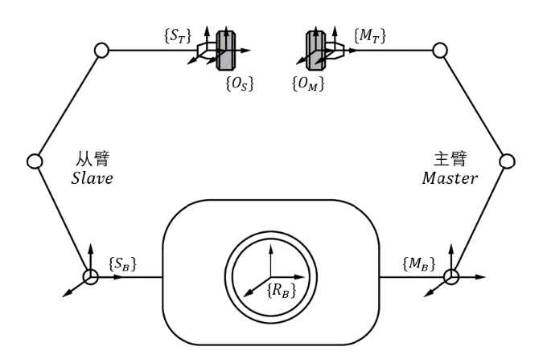
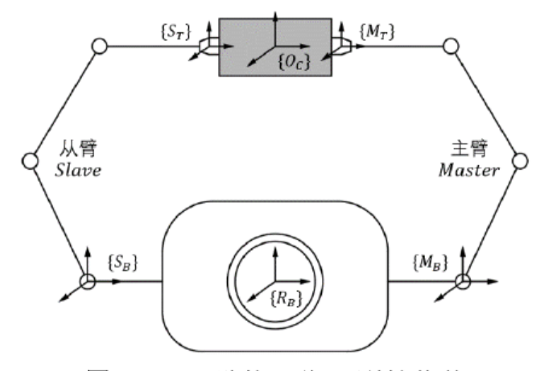

# 双臂协调运动
## 双臂协调运动分类一

> [双臂机器人协调运动规划方法研究_林智峰_哈尔滨工业大学](https://d.wanfangdata.com.cn/thesis/ChJUaGVzaXNOZXdTMjAyMzAxMTISCUQwMjQwNDUwNBoIeDh5dGw3YnM%3D)
>> ROS实验平台搭建 - 运动学建模 - 碰撞检测与路径规划 - **双臂协调运动规划**  
>> 双臂协调运动规划部分已精读

 - 双臂独立运动  
   $\quad\;\;$双臂各自完成相互独立的任务，不需要考虑双臂间的运动学和动力学约束，但是由于双臂工作空间存在重叠区域，需要 ***在规划双臂运动轨迹时进行碰撞检测*** 。  

 - 双臂松协调运动  
  $\quad\;\;$机器人双臂与被操作物体之间形成不完全封闭的，有着一定约束关系的 ***半闭链系统*** 。这个半闭链系统中的约束关系 ***会随着运动过程不断变化*** 。  

 - 双臂紧协调运动  
  $\quad\;\;$ 双臂与被操作物体组成了一个具有完整约束的 ***闭链系统*** 。双臂末端执行器在运动过程中始终 ***保持相对不动*** 。

### 约束推导  

通过机械臂之间的约束关系，推导双臂工具坐标系相对于全局基础坐标系的姿态约束关系  

 

> $\quad\;\;$ 主臂 **Master** : 基座标系$M_B$ 、末端工具坐标系$M_T$   
  $\quad\;\;$ 从臂 **Slave** : 基座标系$S_B$ 、末端工具坐标系$S_T$  
  $\quad\;\;$ 机器人底座 ***Base***： 全局基础坐标系$R_B$ 

#### 基础变换矩阵  

齐次变换矩阵 T 包含位分向量 P 和姿态子矩阵 R  
$
T = \begin{bmatrix} R & P\\ 0 & 1\end{bmatrix}
$

**1. 双臂独立运动约束** ~~起始状态到探照状态~~  

末端操作物体坐标系 - 机器人末端工具坐标系 的齐次转换矩阵 **(下标坐标系相对于上标坐标系)**

$$
\left\{
\begin{aligned}
T_{O_M}^{R_B} = T_{M_B}^{R_B} * T_{M_T}^{M_B} * T_{O_M}^{M_T} \\
T_{O_S}^{R_B} = T_{S_B}^{R_B} * T_{S_T}^{M_B} * T_{O_S}^{S_T}
\end{aligned}
\right.
$$  

用齐次变换矩阵形式表示可得：
$$
T_{O_M}^{R_B} = \begin{bmatrix} R_{O_M}^{R_B} & P_{O_M}^{R_B}\\ 0 & 1\end{bmatrix} \\
T_{O_S}^{R_B} = \begin{bmatrix} R_{O_S}^{R_B} & P_{O_S}^{R_B}\\ 0 & 1\end{bmatrix}
$$  
由此可得机器人末端操作物体与机器人全局坐标系的位置约束关系

$$
\left\{
\begin{aligned}
\underline{P_{O_M}^{R_B}} = R_{M_T}^{R_B} * \underline{P_{M_T}^{O_M}} + \underline{R_{M_B}^{R_B}} * P_{M_T}^{M_B} + \underline{P_{M_B}^{R_B}} \\
\underline{P_{O_S}^{R_B}} = R_{S_T}^{R_B} * \underline{P_{S_T}^{O_S}} + \underline{R_{S_B}^{R_B}} * P_{S_T}^{S_B} + \underline{P_{S_B}^{R_B}} 
\end{aligned}
\right.
$$

> 上式中$P_{M_B}^{R_B} 、P_{S_B}^{R_B}、R_{M_B}^{R_B}、R_{S_B}^{R_B}$均为常值向量和常值矩阵  
> 当规划好双臂所抓物体的运动轨迹时，$P_{O_M}^{R_B}、P_{O_S}^{R_B}$为已知  
> 在运动过程中，被操作物体与抓手之间属于刚性连接， $P_{M_T}^{O_M}、P_{S_T}^{O_S}$ 可以通过计算与测量得到  
> 由上式即可计算得出$P^{M_B}_{M_T}、P^{S_B}_{S_T}$  

推导出双臂工具坐标系 $M_T、S_T$ 相对于全局基础坐标系的位置向量 $R_B$ 的位置向量：  
$$  
\left\{
\begin{aligned}
P^{R_B}_{M_T} = P^{R_B}_{M_B} + R^{R_B}_{M_B} * P^{M_B}_{M_T} \\
P^{R_B}_{S_T} = P^{R_B}_{S_B} + R^{R_B}_{S_B} * P^{S_B}_{S_T}
\end{aligned}
\right.
$$

同理，由$T_{O_M}^{R_B}、T_{O_S}^{R_B}$的齐次变换矩阵展开化简可得机器人末端操作物体坐标系与机器人全局坐标系的姿态约束关系：
$$
\left\{
\begin{aligned}
\underline{R^{R_B}_{O_M}} = \underline{R^{R_B}_{M_B}} * R^{M_B}_{M_T} * \underline{R^{M_T}_{O_M}} \\
\underline{R^{R_B}_{O_S}} = \underline{R^{R_B}_{S_B}} * R^{S_B}_{S_T} * \underline{R^{S_T}_{O_S}}
\end{aligned}
\right.
$$  

> 上式中$R^{R_B}_{M_B}、R^{R_B}_{S_B}、R^{M_T}_{O_M}、R^{S_T}_{O_S}$是常值矩阵，$R^{R_B}_{O_M}、R^{R_B}_{O_S}$可由轨迹规划得出  
> 由此可计算得出$R^{M_B}_{M_T}、R^{S_B}_{S_T}$   
> 通过合理建系可以将$R^{M_T}_{O_M}、R^{S_T}_{O_S}$变为单位矩阵，即被操作物体与机器人末端姿态始终保持一致  

由此可推导出双臂工具坐标系 $M_T、S_T$ 相对于全局基础坐标系的位置向量 $R_B$ 的姿态约束关系：  
$$  
\left\{
\begin{aligned}
R^{R_B}_{M_T} = R^{R_B}_{O_M} = R^{R_B}_{M_B} * R^{M_B}_{M_T} \\
R^{R_B}_{S_T} = P^{R_B}_{O_S} = R^{R_B}_{S_B} * R^{S_B}_{S_T}
\end{aligned}
\right.
$$

**2. 双臂松协调运动约束** ~~调整两灯头配合探照姿态~~  

实际规划时,先规划好的主臂运动轨迹，再结合双臂约束关系再对从臂轨迹进行规划。  
为了实现最终的规划需要推导出从臂的工具坐标系相对于机器人全局基础坐标系的约束矩阵$T^{R_B}_{S_T}$。  
在运动过程中，双臂末端所操作物体之间存在一个变化的约束关系，从臂所持物体坐标系$O_S$相对于主臂所持物体坐标系的齐次变换矩阵表示为
$$
T^{O_M}_{O_S} = \begin{bmatrix} R^{O_M}_{O_S} & P^{O_M}_{O_S}\\ 0 & 1\end{bmatrix}
$$  
从臂工具坐标系$S_T$经由两个被操作物体，沿主臂通路得到相对全局基础坐标系$R_B$的变换关系为：
$$
T^{R_B}_{O_S} = T^{R_B}_{M_T} * T^{M_T}_{O_M} * T^{O_M}_{O_S}
$$
从臂的工具坐标系相对于机器人全局基础坐标系$R_B$的约束矩阵$T^{R_B}_{S_T}$
$$
T^{R_B}_{S_T} = T^{R_B}_{O_S} * T^{O_S}_{S_T} = T^{R_B}_{M_T} * T^{M_T}_{O_M} * T^{O_M}_{O_S} * T^{O_S}_{S_T}
$$  
代入齐次变换矩阵形式，展开后化简可得：
$$
\left\{
\begin{aligned}
P^{R_B}_{S_T} = R^{R_B}_{M_T} * R^{M_T}_{O_M} * R^{O_M}_{O_S} * P^{O_S}_{S_T} + R^{R_B}_{M_T} * R^{M_T}_{O_M} * P^{O_M}_{O_S} + R^{R_B}_{M_T} * P^{M_T}_{O_M} + P^{R_B}_{M_T} \\
R^{R_B}_{S_T} = R^{R_B}_{M_T} * R^{M_T}_{O_M} * R^{O_M}_{O_S} * R^{O_S}_{S_T}
\end{aligned}
\right.
$$  

**3. 双臂紧协调运动约束** ~~以固定配合探照姿态移动探照位置~~  
  
被操作物体坐标系$O_C$相对于机器人全局基础坐标系$O_C$的齐次变换矩阵$T^{R_B}_{O_C}$可以通过主臂坐标变换或从臂坐标变换得出：
$$
\left\{
\begin{aligned}
T^{R_B}_{O_C} = T^{R_B}_{M_B} * T^{M_B}_{M_T} * T^{M_T}_{O_C} \\
T^{R_B}_{O_C} = T^{R_B}_{S_B} * T^{S_B}_{S_T} * T^{S_T}_{O_C} 
\end{aligned}
\right.
$$
联立等式可得双臂间位姿约束方程：
$$
T^{R_B}_{M_B} * T^{M_B}_{M_T} * T^{M_T}_{O_C} = T^{R_B}_{S_B} * T^{S_B}_{S_T} * T^{S_T}_{O_C} \\
$$
展开齐次变换矩阵
$$
R^{R_B}_{M_T} * P^{M_T}_{O_C} + R^{R_B}_{M_B} * P^{M_B}_{M_T} + P^{R_B}_{M_B} = R^{R_B}_{S_T} * P^{S_T}_{O_C} + R^{R_B}_{S_B} * P^{S_B}_{S_T} + P^{R_B}_{S_B} \\
R^{R_B}_{M_B} * R^{M_B}_{M_T} *+* R^{M_T}_{O_C} = R^{R_B}_{S_B} * R^{S_B}_{S_T} *+* R^{S_T}_{O_C}
$$

## 双臂协调运动分类二

> [基于ROS的七自由度双臂协作机器人控制系统研究_从永正_合肥工业大学](https://d.wanfangdata.com.cn/thesis/ChJUaGVzaXNOZXdTMjAyMzAxMTISCUQwMjUzNTc4MxoIZ3Rpb2YzbzM%3D)  

- 耦合协作运动  
$\quad\;\;$运动中双臂末端执行器保持相对静止，即 *双臂末端间的齐次变换矩阵保持不变* 。  
- 叠加协作运动  
  $\quad\;\;$双臂末端执行器有相对运动，即 *双臂末端之间的齐次变换矩阵是时变的* 。  

### 约束推导
1. 耦合协作运动
2. 叠加协作运动

# 双臂控制方法

 - 主从控制法  
   将机械臂定义为主机械臂和从机械臂。通过操纵主机器人跟随特定的运动轨迹，而从机械臂跟随主机械臂运动，根据任务类型的不同，机械臂与被操作物体之间需要满足特定的约束关系。

 - 集中控制法  
    根据目标物体的期望力和运动轨迹，分别设定每一个机器人的控制目标

 - 分散控制法  
   每一个机器人都由一个独立的控制器控制，用传感器测量机器人之间的相互作用，通过机器人之间的交互和力反馈进行控制

   ## 主从式双臂控制法
   将机器人双臂协作问题转化为双臂末端执行器的位姿约束问题，根据协作任务中双臂末端的关系。将协作类型分为 **耦合协作** 和 **叠加协作** 。
   - 双臂末端保持相对静止的运动过程称之为耦合协作运动
   - 双臂末端有相对运动的运动过程称之为叠加协作运动  

    先根据特定轨迹的参数方程规划出主臂的期望运动轨迹，然后通过双臂末端执行器之间的位姿和速度协调约束关系规划出从臂的期望运动轨迹。 

# 3. 协作情况下双臂协作运动轨迹规划

$\quad\;\;$主从式协作规划方式：先确定主机械臂的运动轨迹，进而通过 **主从臂之间的约束关系** 计算 **从机械臂的运动轨迹** ，达到双臂协作运动的效果。建立协作运动过程中位姿约束关系是解决协作问题的核心。  

# 3.1 齐次变换矩阵相关内容  
$$
\begin{aligned}
&^{A}P_B : 点B在坐标系A中的位置向量 \\
&^{A}R_B : 坐标系B相对于坐标系A的旋转矩阵 \\
&^{A}T_B : 坐标系B在坐标系A中的齐次变换矩阵    
\end{aligned}
$$

$$
\left\{
\begin{aligned}
&^{A}T^{-1}_B = ^{B}T_A \\
&^{A}R^{T}_B = ^{A}R^{-1}_B = ^{B}R_A \\

\end{aligned}

\right.
$$

